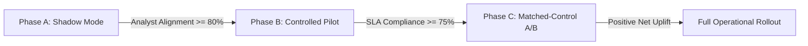

# Upay MFS Intelligence Command Center — Pilot Implementation Plan

> **CRITICAL COMPLIANCE NOTICE**: All metrics and timelines in this document describe a **proposed forward rollout plan**. No actual Upay pilot has taken place. All system demonstrations utilize illustrative synthetic data scenarios.

---

## 1. Executive Summary

The MFS Intelligence Command Center bridges predictive machine learning with frontline operational workflows. To validate real-world efficacy, mitigate false-positive operational fatigue, and verify algorithmic safety, this three-phase pilot framework transitions the system from passive observation to causal uplift measurement.

---

## 2. Phase A: Shadow Mode (Duration: 2 Weeks)

### Objectives
- Observe model inference stability under production batch cycles without dispatching frontline actions.
- Quantify analyst agreement with algorithmically proposed Next Best Actions.
- Validate scoring stability and prevent alarm fatigue.

### Operational Setup
- **Scope**: Entire agent (800) and merchant (5,000) synthetic or production ledger network.
- **Intervention Execution**: Zero field visits dispatched. Actions remain in `PROPOSED` state for operator review.
- **Data Streams**: Daily batch prediction ingestion; parallel comparison with standard operations logs.

### Exit Criteria & Success Gate
1. **Analyst Review Agreement**: >= 80% of top-10 recommended actions validated by Operations Analysts.
2. **Scoring Stability**: Daily priority ranking turnover < 30% for non-urgent entities.
3. **Inference Latency**: Batch scoring completes in < 15 minutes before 06:00 AM daily briefing window.

---

## 3. Phase B: Controlled District Pilot (Duration: 4 Weeks)

### Objectives
- Deploy the Daily Priority Queue to Territory Officers (TO) and District Managers in two representative districts.
- Test mobile responsiveness (360px Bangla view) and field acceptance.
- Measure review-to-dispatch turnaround time (Suggested Demo SLA).

### Operational Setup
- **Target Districts**: 
  - District 1: Semi-urban / commercial hub (e.g., Bogra).
  - District 2: Remittance-heavy regional network (e.g., Sylhet).
- **Users**: 2 District Managers, 8 Territory Officers.
- **Workload Ceiling**: Capped at **Top 10 Actions Today** per officer per shift to avoid review queue overload.

### Tracked Pilot KPIs
- **Action Acceptance Rate**: Target >= 80% (Proposals approved vs rejected).
- **Median Review Time**: Target < 2.0 hours from morning brief issuance.
- **Completion Rate**: Target >= 70% closed-loop field follow-up logged within SLA window.
- **Bangla UI Usability**: 100% readable on field smartphone devices (360px width, high-contrast semantic tokens).

### Exit Criteria & Success Gate
1. Officer feedback score >= 4.0 / 5.0 on action clarity and suggested next steps.
2. Verified zero erroneous rebalancing instructions dispatched to field.

---

## 4. Phase C: Matched-Control Quasi-Experimental Evaluation (Duration: 8 Weeks)

### Objectives
- Rigorously measure the causal business uplift of the Next Best Action engine versus business-as-usual operations.
- Avoid contamination between treated and untreated agent clusters.

### Experimental Design
- **Treatment Cohort**: 4 operational districts utilizing the Daily Operations Command Center.
- **Synthetic Matched Control**: 4 demographically and transactionally matched districts operating on legacy reactive practices.
- **Matching Covariates**: Total active agent count, historical cash-out volume, merchant density, and 90-day baseline churn rate.

### Evaluated Business Outcomes
| Metric Domain | Treatment vs Control Primary Indicator | Target Uplift Proxy |
| :--- | :--- | :--- |
| **Agent Liquidity** | Cash-out stockout / service depletion incidents | >= 25% relative reduction |
| **Merchant Retention** | Forward 30-day reactivation rate among flagged merchants | >= 15% increase in active status |
| **Field Efficiency** | Actions resolved per territory officer per week | >= 30% productivity gain |
| **Float Utilization** | Capital tied up in stagnant float buffers | >= 18% reduction vs 7-day max rule |

---

## 5. Governance & Human-in-the-Loop Safeguards

1. **No Autonomous Money Movement**: The system recommends float rebalancing buffers; execution requires dual-authorization on core banking interfaces.
2. **Documented Model Boundaries**:
   - Agent Liquidity: Point forecasts are acknowledged as weak ($R^2 \approx -0.009$); operations rely on calibrated empirical $P90$ safety buffers (89.93% coverage).
   - Merchant Demand: Category-level volume only; explicitly disclaimed against individual merchant forecasts.
3. **Audit Trail**: Every proposed, approved, rejected, or completed action logs reviewer identity, timestamp, and feedback into the immutable SQLite / Supabase audit ledger.
